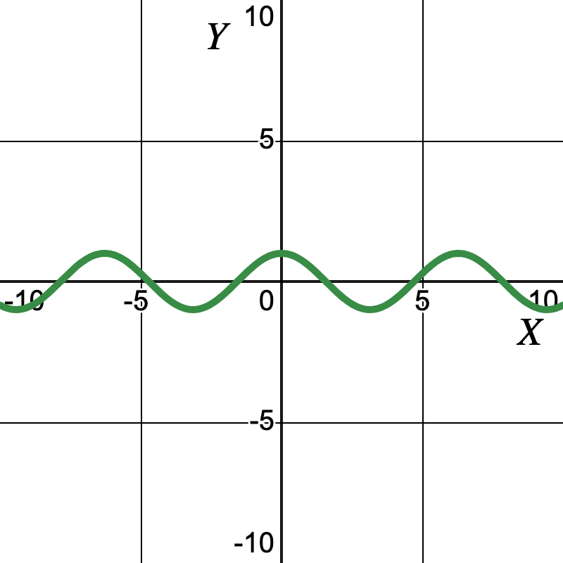
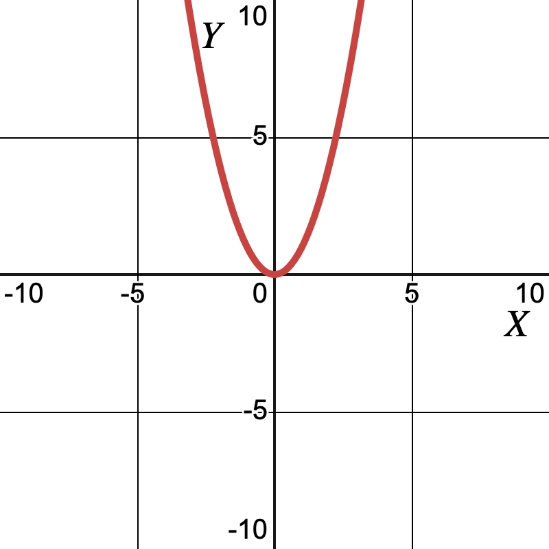
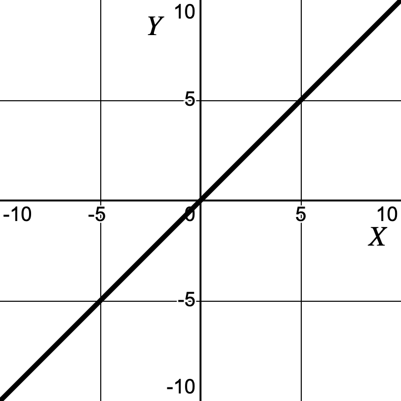
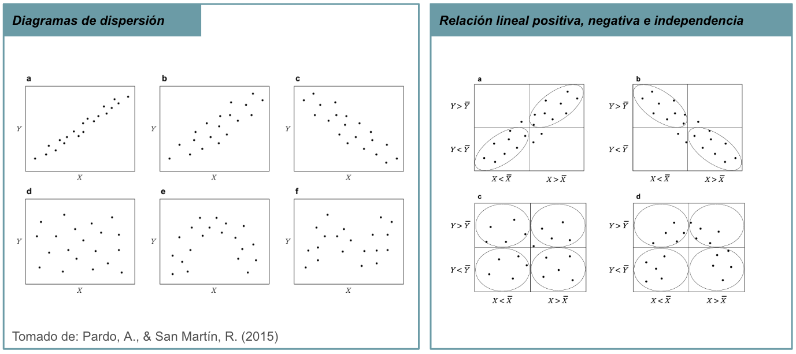
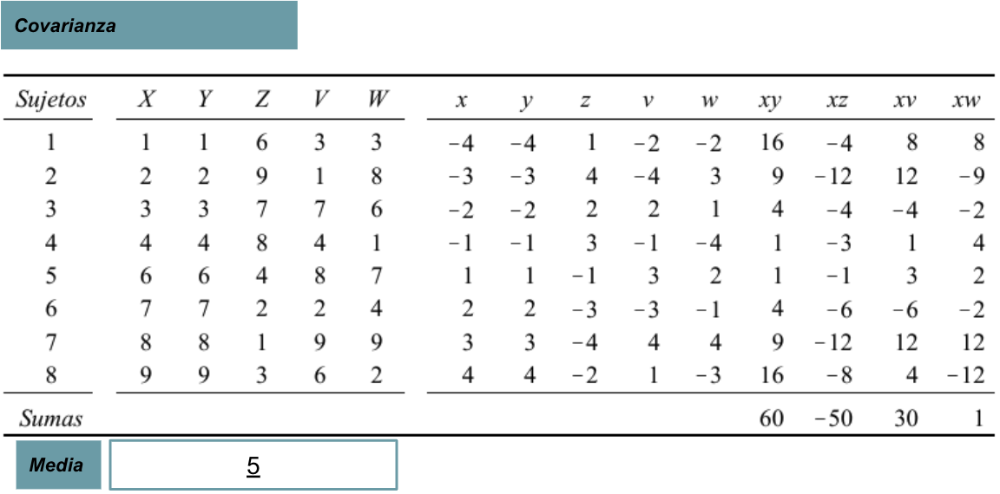
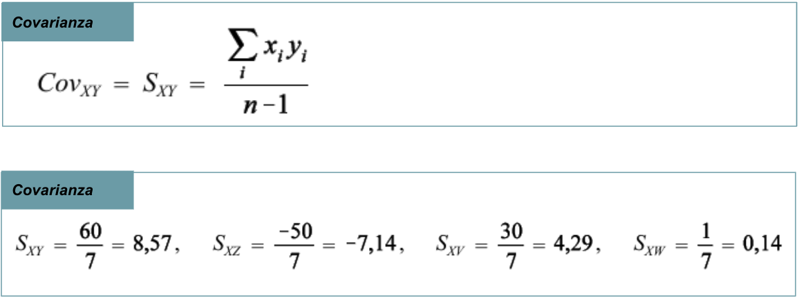
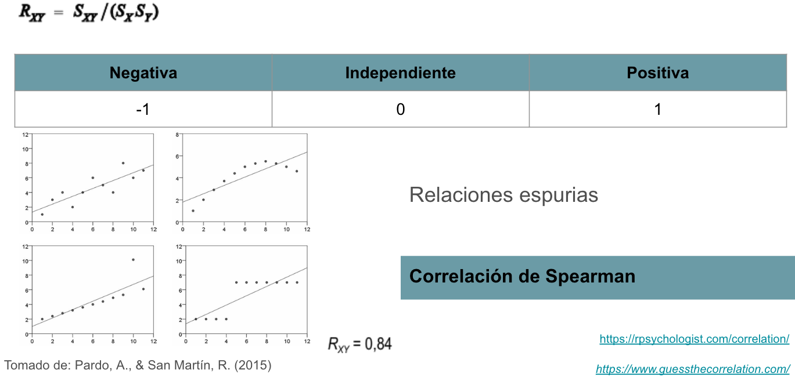
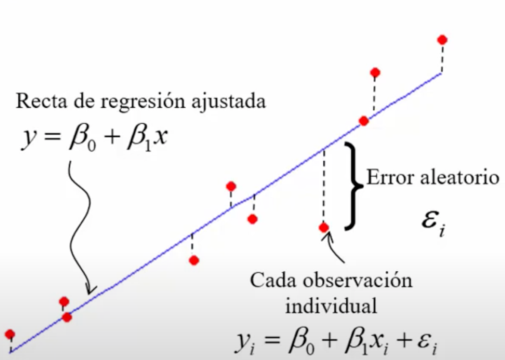
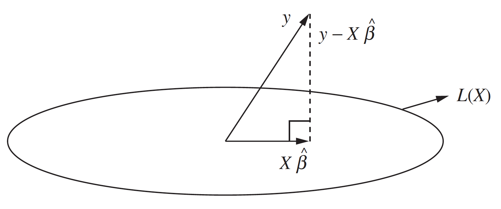

```{r setup, include=FALSE}
knitr::opts_chunk$set(echo = TRUE)
```

# Introducción

Los modelos lineales son ampliamente utilizados en estadística y aprendizaje automático debido a su simplicidad y facilidad de interpretación.

## Asociación vs Causalidad

| Asociación | Causalidad |
|------------------------------------|------------------------------------|
| \* Cuantifica la **fuerza de relación** entre dos variables. | \* Relación en la que un cambio en una variable (la **causa**) produce un cambio en otra variable (el **efecto**). |
| \* El análisis de **correlación** mide la asociación, no significa causalidad. | \* El análisis de **regresión** puede ayudar a confirmar una relación de causa y efecto, pero [no]{style="color:red"} puede ser la única base de tal afirmación. |
| \* El coeficiente de correlación indica el grado de relación simultáneo entre dos variables. | \* En la regresión me interesa construir una función que arroje una **predicción**. |
| $\hat{\rho}_{x,y} = \hat{\rho}_{y,x}$ | $Y = f(X) + e$ |

Por lo que en la regresión, se pueden hacer dos diferentes análisis:

-   **Análisis explicativos:** Desentrañar la estructura y la forma de función.
-   **Análisis predictivos:** Aprender la función para meterle valores de X y obtener predictores de Y.

[**Advertencias:**]{style="color:red"}

-   La causalidad implica una correlación necesaria.
-   Se puede predecir si la relación **NO** es causal.
-   La causalidad puede ser **bidireccional**.
-   La dependencia (escogencia de variable independiente) puede ser **pragmática**.
-   Puede existir causalidad así hayan datos atípicos, esto debido a **errores de medición**.

## ¿Qué es un Modelo Lineal?

Un modelo proporciona **un marco teórico para comprender mejor un fenómeno de interés**, brindando aproximaciones útiles sobre las relaciones entre las variables.

### Una Ecuación Lineal

En un modelo, se asume que **la relación entre** $X$ y $Y$ se puede capturar por medio de una función matemática.

{width=30%}
{width=30%}
{width=30%}

Le llamamos modelos **lineales** porque esta función es una **ecuación lineal**, la cual describe una línea recta en un plano cartesiano (espacio bidimensional).

### Ejemplo gráfico

Una ecuación lineal tiene la forma: $$y = a + bx$$ donde

-   $a$: Es el valor inicial o **intercepto**.
-   $b$: Es la **pendiente**, que determina cómo cambia $y$ por cada unidad de cambio en $x$.

Una ecuación lineal expresa que la **combinación lineal** de las variables es igual a un valor constante $b$.

```{r, results = 'hold'}
knitr::include_url("https://www.desmos.com/calculator/tohv4xqb0k")
```
Explorar: <https://www.desmos.com/calculator/tohv4xqb0k>

```{r, results = 'hold'}
# Vectores
x1 <- c(1, 1)
x2 <- c(0, 2)

# Combinaciones lineales
(2 * x1) - (3 * x2)

(-10 * x1) + (2000 * x2)

((2/3) * x1) + (sqrt(35) * x2)
```

# Correlación

## Visualización entre variables cuantitativas

{width=100%}


## Cuantificar la intensidad de la relación

{width=100%}

## Otras medidas de asociación

{width=100%}

## Correlación de Pearson

{width=100%}

# Regresión lineal

La ecuación de una línea recta que relaciona dos variables es

$$\mathbf{y} = \mathbf{\beta_0} + \beta_1 \mathbf{x}$$ **¡Pero el mundo NO es estrictamente lineal!**

Aunque los datos pueden seguir un patrón aproximado lineal, *la línea generalmente no pasará por encima de todos los puntos*. 

Esto se debe a los **errores**, que representan la distancia entre los datos observados y la línea recta.

{width=50%}

Tomado de: [Regresión Lineal Simple. Conceptos básicos](https://www.youtube.com/watch?v=vbd3QJPHTJM)

El objetivo de la regresión lineal es encontrar los coeficientes $\mathbf{\beta}$ que minimicen estos errores.

Esto se hace generalmente utilizando el **método de mínimos cuadrados**.

*Jugar a minimizar el error:* <https://huggingface.co/spaces/FreddyHernandez/linear_regression_game>

## Regresión Lineal Simple

La regresión lineal simple tiene la siguiente forma:

$$\mathbf{y} = \mathbf{\beta_0} + \beta_1 \mathbf{x} + \mathbf{\epsilon}$$ donde

-   $\mathbf{y}$ es la variable dependiente o respuesta.

-   $\mathbf{x}$ es la variable independiente o predictora.

-   $\mathbf{\beta_0}$ es el intercepto (el valor de $y$ cuando $x = 0$).

-   $\beta_1$ es la pendiente de la línea o el coeficiente que indica el cambio en $y$ por cada unidad de cambio en $x$.

-   $\mathbf{\epsilon}$ es el término de error, que captura la variabilidad en $y$ no explicada por $x$.

[**Aclaración:**]{style="color:red"} El modelo es lineal en los parámetros ($\beta$) no en las variables independientes ($\mathbf{X}$).

## Regresión Lineal Múltiple

Cuando la respuesta $\mathbf{y}$ está influenciada por **más de una variable predictora**, se extiende a la forma:

$$\mathbf{y} = \mathbf{\beta_0} + \beta_1 \mathbf{x_1} + \beta_2 \mathbf{x_2} + \cdots + \beta_{p-1} \mathbf{x}_{p-1} + \epsilon$$
o de forma matricial:

\begin{align}
\mathbf{y} &= \mathbf{X} \mathbf{\beta} + \mathbf{\epsilon} \\
\begin{bmatrix} y_{1} \\ y_{2} \\ \vdots \\ y_n \end{bmatrix}_{n \times 1} &= 
\begin{bmatrix}
1 & x_{11} & x_{12} & \cdots & x_{1,p-1} \\
1 & x_{21} & x_{22} & \cdots & x_{2,p-1} \\
\vdots & \vdots & \vdots & \ddots & \vdots\\
1 & x_{n1} & x_{n2} & \cdots & x_{n,p-1} \\
\end{bmatrix}_{n \times p}
\begin{bmatrix} \beta_{0} \\ \beta_{1} \\ \vdots \\ \beta_{p-1} \end{bmatrix}_{p \times 1} + 
\begin{bmatrix} \epsilon_{1} \\ \epsilon_{2} \\ \vdots \\ \epsilon_n \end{bmatrix}_{n \times 1}
\end{align}

### Representación geométrica

Se puede observar que $\mathbf{X} \mathbf{\beta}$ es una combinación lineal de los vectores $\mathbf{X}$.

En regresión lineal, buscamos **modelar la relación entre las variables predictoras $\mathbf{X}$ y la respuesta $\mathbf{y}$ usando un vector de coeficientes $\mathbf{\beta}$**. 

El **espacio columna de** $\mathbf{X}$ son todas las combinaciones lineales posibles.

Pero **la variable respuesta $\mathbf{y}$ no hace parte de ese espacio columna**.

[**¿Qué se debe hacer?**]{style="color:red"}

Proyectar a $\mathbf{y}$ sobre el espacio columna de $\mathbf{X}$ y encontrar la que más minimice el error.

De forma que las predicciones serán:

$$\hat{\mathbf{y}} = \mathbf{X} \hat{\mathbf{\beta}}$$
{width=50%}
Tomado de: Abraham & Ledolter (2004)

## Ejemplo en R

Los datos a analizar corresponden a una serie de variables sociales, educativas, deportivas y de seguridad en las zonas rurales de Antioquia en Colombia para el año 2016.

Los datos son tomados de:

- [Shiny App URL](https://danielrivera1.shinyapps.io/Regression2/)

- [RStudio Cloud Project](https://rstudio.cloud/project/249309)

que a su vez, se encuentran disponibles públicamente en la página del Anuario Estadístico de Antioquia del Departamento Administrativo de Planeación.

```{r, results = 'hold'}
datos <- read.csv("./data/safety_data.csv", dec = ",")
str(datos)
```
```{r, results = 'hold'}
# Diagrama de dispersión
plot(datos[c("LesionesPer", "SchoolDes", "Extortions", "SportsScenari")])
```

```{r, results = 'hold'}
# Pearson
cor(datos[c("LesionesPer", "SchoolDes", "Extortions", "SportsScenari")])
```

```{r, results = 'hold'}

# Regresión Lineal Simple
mls <- lm(LesionesPer ~ Extortions, data = datos)

# Resumen del modelo
summary(mls)
```
**Interpretación:**

- **Intercepto (8.372):** Cuando no hay extorsiones (Extortions = 0), el modelo predice un promedio de 8.372 lesiones personales.
- **Pendiente (12.358):** Por cada aumento de una unidad en extorsiones, se predice un incremento promedio de 12.358 en las lesiones personales. Este coeficiente es estadísticamente significativo (**p < 0.001**).
- **Coeficiente de determinación (R-squared):** expresa el porcentaje de varianza explicado por el modelo, en este caso, es del 40.5%
- **Coeficiente de determinación (Adjusted R-squared):** penaliza a $R^2$ dependiendo el número de parámetros. **No se puede interpretar como porcentaje de varianza explicado**. Tiene valores entre 0 y 1, y cuánto más cercano a 1, mejor.

# Bibliografía

-   Abraham, B. & Ledolter J. (2004). Introduction to Regression Modeling.

-   Rencher, A. C. & Schaalje, G. B. (2008). Linear models in statistics. John Wiley & Sons.
